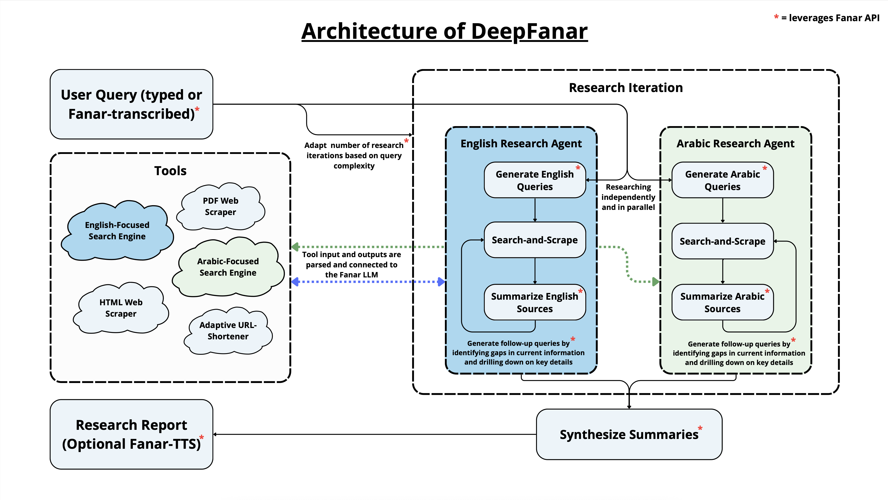

<p align="center">
  
</p>

## Overview

DeepFanar is an AI-powered research assistant built by Alexander Gao and Amin Zare with a modern frontend and robust backend, designed to streamline deep research workflows. It supports multilingual research (English & Arabic), real-time progress streaming, and advanced text-to-speech features.

## Video Demo

[](https://www.youtube.com/watch?v=QlFVlOEjWEg)

Check out our video demo above or [watch it on YouTube](https://www.youtube.com/watch?v=QlFVlOEjWEg).

---

## Features

- **AI-Powered Research**: Submit queries and receive comprehensive, synthesized reports
- **Multilingual Support**: Research in both English and Arabic
- **Real-time Progress**: Stream progress updates during research execution
- **Text-to-Speech**: Convert research reports to audio using Fanar TTS
- **Export Options**: Copy or download reports
- **Source Citations**: All sources are cited with clickable links

## Local Setup

### 1. Clone the Repository
```bash
git clone https://github.com/AminEdZare/DeepFanar.git
cd DeepFanar
```

### 2. Backend Setup (FastAPI)

#### a. Create a virtual environment and install dependencies:
```bash
python3 -m venv .venv
source .venv/bin/activate
pip install -r requirements.txt
```

#### b. Set up environment variables:
Create a `.env` file in the root directory with the following keys:
```
FANAR_API_KEY=your_fanar_api_key
TAVILY_API_KEY=your_tavily_api_key
GOOGLE_API_KEY=your_google_api_key
GOOGLE_SEARCH_ENGINE_ID=your_google_cx_id
```

#### c. Run the backend server:
```bash
uvicorn deep_research.app:app --reload --host 0.0.0.0 --port 8000
```

### 3. Frontend Setup (React + Vite)

```bash
cd deep-research-frontend
npm install
npm run dev
```
The frontend will run on `http://localhost:5173` by default.

### 4. Usage
- Open the frontend in your browser.
- Enter a research query (in English or Arabic).
- View real-time progress and final report.
- Use the text-to-speech feature or download the report.

---

## Architecture

For a visual overview of the system architecture, see the diagram below:

<p align="center">
  
</p>